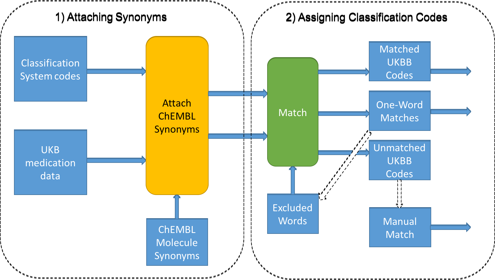

# UK Biobank Self Reported Medication Data parsing and matching
## Background
UK Biobank self reported medications are represented in UK Biobank as a list of codes per participant captured at the time of the Baseline Assessment Interview. 

For example, participant id '000001' may have reported medications with UKBB codes 1140922174, 1140879424, 1140879616, 1197 and 2038460150.

These are described in the UKBB medication codes table as:

| Code     | Description                | Report Count |
| -------- | -------------------------- | -----------: |
|1140922174|alendronate sodium          |6380          |
|1140879424|alverine                    |308           |
|1140879616|amitriptyline               |10119         |
|1197      |evening primrose oil product|1132          |
|2038460150|paracetamol                 |100036        |

There is no structure in the data and no means of grouping medication into categories such as "Drugs for Diabetes" or "Drugs to control Asthma". 

## Aims
Write and test software to match terms in the UK Biobank Self Reported Medication data coding table with terms in both the Anatomical Therapeutic Chemical (ATC) classification system and in the British National Formulary (BNF) coding system. The overall aim being to assign higher level well-known codes to allow grouping of the data. The resulting matched data can then be used in conjuction with the UKBB medication codes assigned at assessment time to generate evidence for use in both individual clinical phenotypes and in ranges of clincal phenotypes as found in Phenome-Wide association studies (PheWAS).

## Description
Matching code is written in Python 2 (2.7 was intially used for development, changes for Python 3 have now been made). Extensive use of Bash shell wrappers is made to supply context at run time - code and data directory locations, data file names and database access parameters. 

The key features to note are;

- Matching is performed using combinations of whole words only (no partial word matches) and, in the case of matching synonyms to description (Step 01), whole phrase matching is used.

- Synonyms from the ChEMBL database are attached to both 'sides' of the main medication term match, as part of data preparation.

- During testing an excluded word list was built (cf. stop words from Natural Language Processing) to prevent the software from making unwanted one-word matches, as part of an iterative process. 

- All code is intended to be run from a Linux / Unix command line. 

The following subdirectories can be found in the repository:

- *env/* Environment variables used are shown in a single file 'common_tplt', users should complete these and copy to a file named 'common', users must also pre-define the **PROJDATA** and **PROJROOT** environment variables as these are used as roots to data and code directory trees. Parameters for local chembl database access are also required for drug synonym extraction and ATC code extraction. The code example supplied is for the sqlite edition of the chembl database which can be found at: [The ChEMBL site, download section](https://www.ebi.ac.uk/chembl), the project used version 23, which is no longer the latest version at the time of writing. Downloads for other DBMS's are available.

- *py/* Python scripts, scripts to match synonyms prior to matching across coding systems. Also included is the module 'datahelper.py' which is where the text matching code is to be found. There are two lower level directories where scripts to extract and format ChEMBL data and to process phenotype data reside.

- *sh/* Bash shell scripts, wrappers for the python code split into several main functions and provided for coding against the ATC and BNF classification systems.

Top-level scripts are prefixed '01_', '02_', '03_' and '04' for each classification system and call several lower level bash scripts. The '03_' scripts are for code assignment to data for individual medication reports in UKBB, the path and filename for UKBB phenotype data for a project must be supplied via the sourced 'common' environment parameter file.

- *data/* Generated match data for both ATC and BNF coding, this does not include manually assigned coding. The excluded words list, which probably should be an independent text file is embedded in ../py/datahelper.py and can be extracted using the .../*py*/list_excl_words.py script. 

## Running
Once the environment has been set up (see the note on the .../*env*/common file above), four scripts are run, with parameters for either ATC or BNF code assignment, through to phenotype generation (0,1) for PheWAS.

Script '01' runs data preparation steps, note that raw BNF data is not supplied in this repository due to potential licensing requirements. At this point ChEMBL synonyms and, in the case of the ATC-based match, ATC codes and terms are extracted from the ChEMBL database

Script '02' runs matching scripts to 'merge' in ChEMBL synonym data and produce data on matched and unmatched UKBB medication codes.

Script '03' calls scripts to extract medication detail data from the main UKBB phenotype csv file (the name of this varies by project and should be assigned in the .../*env*/common file via an environment variable) and then to assign the ATC or BNF codes output in step 02.

Script '04' calls scripts to annotate and generate PheWAS phenotypes as binary 1 (CASE) or 0 (CONTROL)

For ATC-based matching run:
- 01_atc_prepare_sqlite.sh
- 02_atc_match.sh
- 03_get_ukbb_srmed_data_atc.sh
- 04_make_atc_phewas_phenotypes.sh

For BNF-based matching run:
- 01_bnf_prepare_sqlite.sh
- 02_bnf_match.sh
- 03_get_ukbb_srmed_data_bnf.sh
- 04_make_bnf_phewas_phenotypes.sh

## Flow Summary, steps 01 and 02

## Notice

BNF coding system data was obtained and is presented in accordance with the “Open Government Licence for Public Sector Information” (http://www.nationalarchives.gov.uk/doc/open-government-licence/version/3/) and the NHS Business Services Authority (NHSBSA) “Terms and Conditions for Users” (https://www.nhsbsa.nhs.uk/our-policies/terms-and-conditions).  Authors: PDA, ASFD and ERJ as users of this resource also make the following statement consistent with these terms and conditions:  “NHSBSA BNF Classification Coding, NHSBSA Copyright 2019” This information is licenced under the terms of the Open Government Licence.
